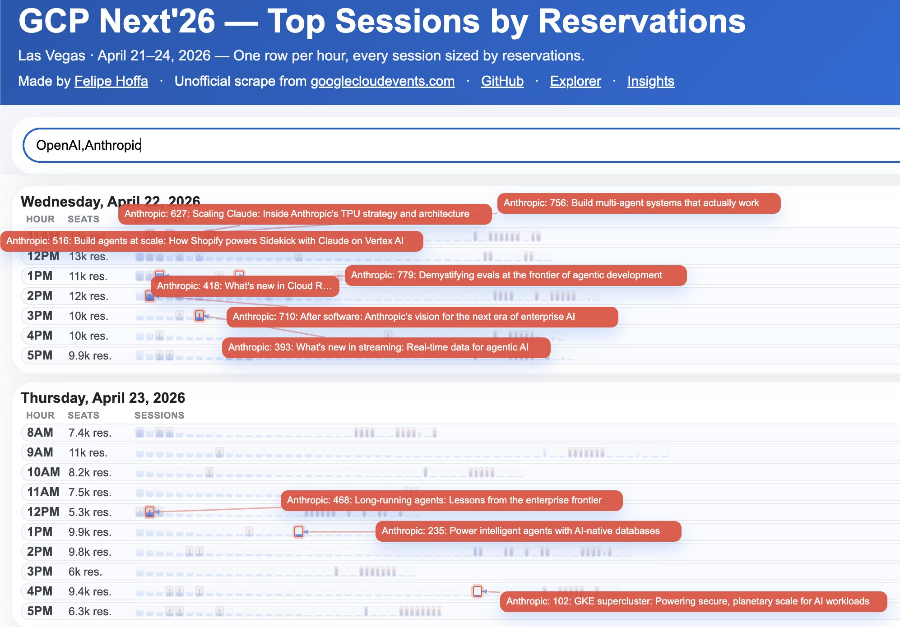

# Google Cloud Next 2026 unofficial scrape

## Explore the published site

- **Session explorer:** https://fhoffa.github.io/google-cloud-next-2026-unofficial-scrape/
- **Insights page:** https://fhoffa.github.io/google-cloud-next-2026-unofficial-scrape/insights.html

Unofficial scraper/exporter for the Google Cloud Next 2026 session library — plus a fast browseable website for actually exploring the sessions.

## What this project does

This repo now has **two useful layers**:

1. **Scraper/exporter**
   - crawls the paginated session library
   - fetches individual session pages
   - exports structured JSON/YAML snapshots

2. **Website UI**
   - lets you browse, filter, favorite, share, and explore sessions in a much nicer way than the source site

## Website features

## Preview




Current site features include:

- full-text session search
- speaker search
- day filtering
- topic filtering
- sort by time or title
- favorites stored locally in the browser
- compact shareable favorites links via `sessionids=...`
- `Copy link to my favorites`
- clickable speaker filters from session cards
- clickable company filters from session cards
- clickable topic tags from session cards
- quick-clear `×` buttons for session and speaker filters
- active filter pills with per-filter clear
- time filtering with a visual **start/end range slider** (15-minute increments)
- tabs for:
  - **Sessions**
  - **Top speakers**
  - **Top words**
- separate **Insights** page (`/insights.html`) with Sankey segment links back to filtered session explorer views
  - published Sankey images use contextual dated filenames like `fhoffa.github.io_google-cloud-next-2026-unofficial-scrape_sankey_YYYYMMDD.png`
- Top speakers view with:
  - speakers appearing in multiple sessions
  - clickable speaker names to pivot back into the main sessions view
  - clickable session links to open the Google event page
- Top words view with:
  - more non-stop-word terms
  - clickable words to pivot back into the main sessions view
- expandable long descriptions
- unscheduled sessions sorted after scheduled ones
- visible footer version stamp for deploy/debug checks
- calendar-style favicon

## Scraper outputs

The scraper exports:

- `sessions/latest.json` / `sessions/latest.yaml` — full dataset, latest run
- `sessions/by-day/YYYY-MM-DD.json` / `.yaml` — sessions partitioned by date
- `sessions/by-day/unscheduled.json` / `.yaml` — sessions with no date yet
- `sessions/detail-manifest.json` — durable detail-cache manifest used to skip unchanged session-page refetches
- `sessions/snapshots/` — timestamped archive of every run

## Fields

Each session record includes:

- `title`
- `description`
- `url`
- `start_at`
- `end_at`
- `date_time`
- `date_text`
- `start_time_text`
- `end_time_text`
- `room`
- `topics`
- `speakers`

## Usage

### Scrape data

```bash
npm run scrape
```

Normal runs keep the fast library extraction and only refetch detail pages for sessions whose library metadata changed, whose detail cache is missing, or whose enrichment is not yet present in `sessions/latest.json`. `FORCE_REFRESH=1 npm run scrape` still performs a full detail rebuild.

Useful options:

```bash
MAX_SESSIONS=10 npm run scrape
FORCE_REFRESH=1 npm run scrape
MIN_DELAY_MS=2000 MAX_DELAY_MS=5000 npm run scrape
BUCKET=2026-04-22 npm run scrape                     # scrape one day only
npm run merge                                        # merge by-day/ files into latest.*
```

### Practical scrape pipeline: fast detection vs full publication pass

This repo currently supports a **full scrape** (`npm run scrape`) and also exposes enough metadata from the paginated session-library pages to justify a future lighter-weight detection pass.

#### What the paginated session-library pages already contain

The library pages already expose useful structured fields such as:
- `id`
- `url`
- `title`
- `date_text`
- `start_time_text`
- `end_time_text`
- `room`
- `session_category`
- `capacity`
- `remaining_capacity`
- `registrant_count`
- `agenda_status`
- `disabled_class`

The scraper now hashes those library-stage fields into a stable per-session fingerprint and stores it in `sessions/detail-manifest.json` alongside the cached detail HTML path and last detail fetch metadata.

That means a **library-only pass** is likely sufficient for:
- detecting newly added or removed sessions
- detecting timing/room/status changes
- availability / fullness monitoring
- deciding whether a full rebuild is worth doing

#### What the individual session-page fetch adds

The per-session fetch is still valuable because it adds or normalizes:
- full `description`
- richer normalized `topics`
- structured `speakers` + company
- derived time fields like `start_at`, `end_at`, and `date_time`
- page-level fallbacks when listing metadata is incomplete

When the fingerprint is unchanged, the scraper reuses the previously enriched session record from `sessions/latest.json` instead of reopening the detail page. If the fingerprint changes, the cache file is missing, or `FORCE_REFRESH=1` is set, the detail page is fetched again and the manifest entry is updated.

That richer metadata is still the safer basis for:
- high-quality classification
- insights regeneration
- Sankey generation
- publication-quality rebuilds

#### Current recommended workflow

Use a two-tier mental model:

1. **Fast/library pass**
   - use paginated library data as a cheap detection gate
   - if nothing meaningful changed, you may skip the expensive full pass

2. **Full publication pass**
   - run `npm run scrape`
   - run `npm run refresh:verify`
   - refresh classifications as needed
   - rebuild `sessions/classified_sessions.json` from the **current live `sessions/latest.json` only**
   - rebuild changelog
   - rebuild insights
   - rebuild Sankey
   - run tests

If you want a single local command for that publication rebuild, use:

```bash
bash scripts/run_publish_pipeline.sh
```

That wrapper runs the current checked-in publication sequence in order:
- rule-based live classification refresh
- changelog rebuild
- insights rebuild
- Sankey rebuild
- related-sessions rebuild
- test suite

It is meant as a convenience wrapper for maintainers, not as a replacement for understanding the individual steps above.

#### Important invariant: classified data must track the current live snapshot

`sessions/classified_sessions.json` is for the **current live dataset**, not an ever-growing archive of every historically seen session.

That means after each fresh scrape:
- keep classifications for sessions whose `url` is still present in `sessions/latest.json`
- classify any newly added live sessions
- drop classified entries for URLs that are no longer present in the live snapshot

If this invariant is violated, downstream outputs like `insights.html`, Sankey counts, and top-level conference stats will overcount stale removed sessions.

In short: the library pages already carry enough metadata to support change detection and fullness checks, but the individual session fetch still matters for publication-grade classification and derived artifacts — and classified output must always be trimmed back to the current live scrape before rebuilding published views.

### Refresh sanity check

```bash
npm run refresh:verify
```

This resolves the current refresh deterministically as:
- `sessions/latest.json`
- the snapshot in `sessions/snapshots/` whose `scraped_at` exactly matches `latest.json`
- the immediately previous live snapshot

It writes `media/refresh-sanity.json` and prints:
- added/removed snapshot counts
- concrete `remaining_capacity` deltas
- concrete `registrant_count` deltas
- warnings when seat/registrant movement exists even though no session crossed the full/not-full boundary

If `latest.json` does not match a snapshot on disk, or if the matching snapshot is not the newest one, the command fails so the refresh cannot quietly build a changelog from a stale pair.

### Rule-based classification fallback

```bash
python3 scripts/classify_new_sessions_rules.py
```

The fallback classifier now reads `sessions/latest.json` by default and rewrites `sessions/classified_sessions.json` for the current live dataset only. It no longer appends sessions from a hardcoded old snapshot or mutates `sessions/latest.json`.

### Regenerate insights page

```bash
npm run build:insights
```

This rebuilds the checked-in static `insights.html` page from `templates/insights.template.html` plus the generated `media/insights-summary.json` summary artifact.

The insights generator is now `scripts/generate_insights.mjs`, and the shared word-stat rules live in `config/word-rules.json` so both the website and the generator use the same stop words, normalization, and display labels.

### Regenerate changelog page

```bash
npm run build:changelog
```

This rebuilds the checked-in static `changelog.html` page from `templates/changelog.template.html` plus the generated `media/changelog-summary.json` summary artifact.

The changelog generator now verifies that `sessions/latest.json` matches the newest snapshot on disk before building. Its summary metadata records the exact previous/current live snapshot pair used for the current refresh.

### Preview the website locally

Use any simple static server from the repo root, for example:

```bash
python3 -m http.server 8000
```

Then open:

```text
http://localhost:8000/
```

## Known issues with the Google site

### "Reserve a Seat" button is broken on individual session pages

If you click a session link (↗) to open the Google Cloud Next session page directly, the **"Reserve a Seat" button does not work** — it appears but clicking it has no effect.

**Workaround:** Go to the [Session Library](https://www.googlecloudevents.com/next-vegas/session-library), search for the session by name, and reserve your seat from there.

## Prior art & legal context

Community session trackers for cloud events have a complicated history. In October 2023, AWS sent cease & desist notices to third-party re:Invent session tracker developers — a situation that permanently destroyed one developer's work before AWS reversed course the same day.

See [PRIOR-ART.md](./PRIOR-ART.md) for the full story.

## Notes

- This is unofficial and based on publicly available event pages.
- The scraper is intentionally conservative: caching, retries, backoff, and one-at-a-time requests.
- Some session types expose less metadata than others.
- Made by [Felipe Hoffa](https://www.linkedin.com/in/hoffa/) while walking, using OpenClaw ([my setup](https://www.linkedin.com/posts/hoffa_every-single-technology-company-now-has-activity-7439822998578294784-gyWA)), Claude Code, and Codex.
